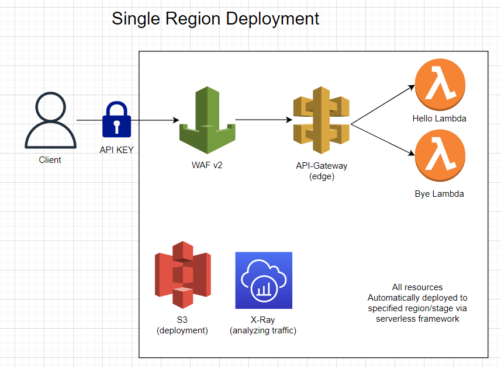
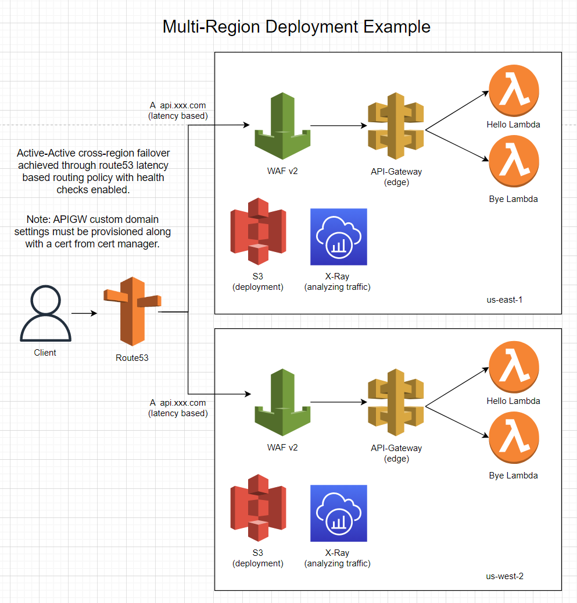

# AWS Serverless API
 

[](https://coveralls.io/github/GagePielsticker/aws-api-template?branch=main)

> A template for an AWS based serverless api. This utilizes lambda, api-gateway, WAFv2 and other various services to build a scalable and highly-available api. Deployment of all infrastructure fully automated via serverless framework :)

## Architecture
<div>
Below is a single region deployment example. All resources here are automatically provisioned and configured via serverless framework and deployed to the configured region.



Below is a multi-region deployment for high availability in the event of an AWS region failure. This also reduces geographic latency to each region deployed. To achieve this active-active behavior we must manually configure a `route53 zone` & `api gateway custom domains`. You then apply 2 `latency based` routing policies to point at each api gateaway via `A record`. Then attach health-checks to each policy to ensure that the services are healthy in that region.


</div>

## Adding new lambdas
Adding lambdas is fairly straight forward. Simply copy one of the lambda folders inside of `/src/lambdas/` and modify the handler code as needed. Note that the handler must return the callback and the data should be in a `json` format. Once that is complete open `serverless.yml` and navigate to the `functions:` section. This is where we specify the file to use in that lambda as well as how it connects to api-gateway. 

Example config:
```yaml
functions:
  hello:
    handler: src/lambdas/hello/handler.handler #fileName.exportName in code
    maximumRetryAttempts: 1 #Retry attempts by lambda on failure
    package: # Only package code relevant to this specific lambda
      patterns:
        - src/lambdas/hello/**
    events: #API Gateway integration
      - http:
          method: get
          path: hello
          cors:
            origin: '*'
```

For more documentation on how its configured, visit [HERE](https://www.serverless.com/framework/docs/providers/aws/guide/functions).

## Configuring API Gateway & Limits
By default, our api-gateway service is secured and will automatically provisioned an api key attached to a `usage plan`. A usage plan is a set of limits of which the api key must abide such as a `rate limit`, `burst limit`, and `quota`. You can modify the limits of this usage plan via the `serverless.yml` under the `apiGateway:` section. 

Example config:
```yaml
apiKeys:
    - private_key: # Used to tie key to usage plan
        - my amazing api key
usagePlan:
    - private_key: # Used to tie key to usage plan. Key will abide by the following
        quota:
            limit: 5000 #maximum 5000 request per month, refreshes on 2nd day
            offset: 2
            period: MONTH
        throttle:
            burstLimit: 200 #maximum number of concurrent requests that API gateway will serve at any given point
            rateLimit: 100 #request per second limit
```
More info on configuration options found [HERE](https://www.serverless.com/framework/docs/providers/aws/events/apigateway).

## Testing
Testing the lambdas and api-gateway integration is fairly simple. Just run the command `npm run dev` or alternatively `serverless offline`. This will stand up a local simulated environment hosted defaultly on port `3000` which you can call using something like [postman](https://www.postman.com/).

## Deployment
To deploy the application to AWS you will first need to install the [AWS CLI](https://docs.aws.amazon.com/cli/latest/userguide/getting-started-install.html). Then proceed with the following steps.

1. Authenticate with your AWS CLI. Whether that be entering access keys in the [credential file](https://docs.aws.amazon.com/cli/latest/userguide/cli-configure-files.html) or alternatively entering [environment variables](https://docs.aws.amazon.com/cli/latest/userguide/cli-configure-envvars.html).
2. Ensure all your unit test are passing with `npm test`
3. Run `npm deploy` which will use the default of stage `dev` and region `us-east-1`. If you wish to manually configure the stage and region, you can do so by modifying the `package.json` script or alternatively running `serverless deploy --stage dev --region us-east-1` manually with your respective changes to that commands parameters.


## Dev Dependencies
- jest
- serverless
- serverless-associate-waf
- serverless-deployment-bucket
- serverless-offline
- standard

## Contributing
Find the contribution document [HERE](/CONTRIBUTING.md) if you wish to work on the repo!